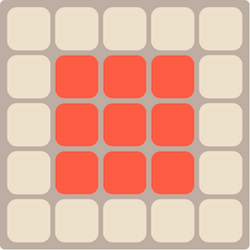
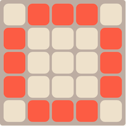
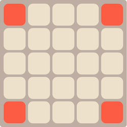
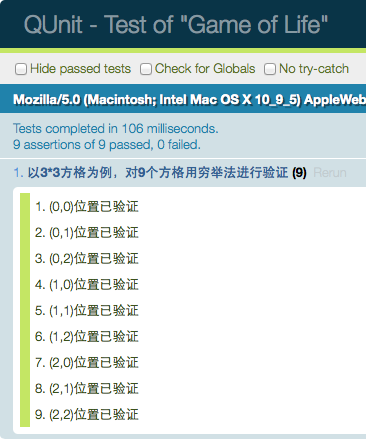

<h1>Game of Life</h1>
<h3>软件21 李&nbsp;&nbsp;&nbsp;&nbsp;盟 2012013283</h3>
<h3>软件22 刘桐彤 2012013331</h3>

 
 

## 一、实验环境

* 系统：MAC OS X 10.9
* 浏览器：Chrome 35.0.1916.153

## 二、发布地址

* 游戏页面：[http://hacker.siyuan12.com/GameofLife](http://hacker.siyuan12.com/GameofLife)
* 单元测试：[http://hacker.siyuan12.com/GameofLife/test](http://hacker.siyuan12.com/GameofLife/test)

## 三、游戏玩法

<table>
<tr>
	<td> ↑/↓: Modify the frequency</td>
    <td> ←/→: Modify the lines</td>
</tr>
<tr>
	<td> Enter/Button"Start": Start</td>
    <td> Space/Button"Pause": Pause</td>
</tr>
<tr>
	<td> F5: random dots</td>
    <td> Click: custom dots</td>
</tr>
</table>

## 四、实现方法

 
程序分为如下四个模块：

1. 初始化模块；
2. 迭代模块；
3. 绘图模块；
4. 事件模块；

下面分别说明各模块的作用。

### 1.初始化模块

STATUS对象中存储了当前游戏的状态，其初始值规定了游戏的初始状态：规格15*15，频率2Hz。初始化函数绑定了键鼠的事件，在页面的信息栏中展示了当前游戏信息，利用随机函数初始化方格并绘制在界面上。

### 2.迭代模块

根据游戏规则，本模块根据如下规则对方格进行迭代。每个方格状态由该方格及周围8个方格上一代的状态决定：

1. 如果周围有3个方格为生，则该方格一定为生；
2. 如果周围有2个方格为生，则该方格状态不变；
3. 在其他情况下，该方格一定为死。

调用迭代函数一次则迭代一次。本模块为程序的主要逻辑部分。

### 3.绘图模块

在网页中采用HTML的canvas进行绘图。在绘图模块中，绘图函数首先清空绘图区域，再绘制背景，然后根据表示方格状态的二维数组，用不同颜色绘制方格。

### 4.事件模块

为了增加游戏的可操控性以及增进游戏的操作体验，我们设计使用键鼠进行操控。我们设计了如下事件：

* 键盘：在游戏停止时，可以用↑/↓方向键调节迭代频率，←/→方向键来调节方格规格，F5可以在方格中随机布点。Enter键使游戏开始，Space键使游戏暂停；
* 鼠标：Start按钮和Pause按钮可以用来控制游戏开始和暂停。另外，在游戏暂停时，通过鼠标点击可以增加和删除点。

## 五、部署方法

 
本次实验采用Github Pages进行发布。在Github上创建版本库GameofLife，再创建gh-pages分支，将代码上传到版本库中，这样即部署完毕，可以通过Github Pages进行访问。

## 六、单元测试

 
### 1.测试环境

* 系统：MAC OS X 10.9
* 浏览器：Chrome 35.0.1916.153

### 2.测试工具

* QUnit：1.15.0

### 3.运行方法

打开test文件夹中的index.html即可进行测试

### 4.测试方法

本实验的测试集中于逻辑部分 - 迭代模块。为了选取合适且全面的测试样例，我们首先对方格的情况进行分析。

考虑到游戏的实际含义，当方格的规格小于3\*3时，部分格子的含义出现矛盾（某些格子具有了多重含义）。所以我们限定方格的规格至少为3\*3。以5*5为例，如下图所示：

考虑到格子的相对位置，图中的格子可以分为3类。如下图所示：

* 中间方块：

* 边缘方块：

* 角落方块：

考虑到各种类别的格子可以用一个有代表性的格子来代表。因此，可以用3\*3的格子来代表。其中中间的格子代表中间方块，边缘的四个格子代表四条边除角落的格子，还有角落的四个格子。

在对9个位置的正确性进行测试时，为了测试情况的完全性，对周围的8个格子以及自身的状态进行穷举，即每个位置进行2^9=512种情况的测试。根据规则，对每个方格，除本身之外，如果为生的方格数为3，则迭代后该方格一定为生；如果为生的方格数为2，则迭代后该方格状态不变；其他情况，则迭代后该方格为死。根据这个事实可以对逻辑模块进行测试。

测试结果截图如下：

程序的其余模块采用走查以及实际操作的方式进行验证，并且验证通过。

## 七、分工情况

* 李盟：编写迭代模块、测试部分，对其他部分提出修改意见，协助编写文档；
* 刘桐彤：编写前端页面、初始化模块、绘图模块、实践模块，提出测试方案，编写文档。

## 八、感受与理解

 
### 1.结对编程的感受

* 李盟：两个人同时在一台电脑上编程，感觉要比一个人慢一些，其中有不适应结对编程这种形式的原因，另外可能两个人一起结对编程的时间变长之后配合的更好，效率应该会相应有一定的提升。不过结对编程的确能避免一些BUG，因为两个人同时出现一样的思维漏洞的概率会比一个人低一些，还有就是在程序出现BUG后两个人一起调试，找出并解决BUG的效率也更高一些。结对编程是编程方式的一种，在适合结对编程的开发情况下采用结对编程也是一种选择吧。
* 刘桐彤：初次与盟主一起尝试结对编程的时候感觉不太适应，感觉传统的单人编程方式似乎更适合我。但是经过一段时间的尝试后，发现结对编程的优势很明显。首先最明显的体现是BUG的明显减少，一人编写，一人走读，程序的BUG很容易被发现和修改。其次，在过程中遇到一些设计或编写上的困难，两人可以共同协商解决。另外，传统方式中，两人合作时经常采用分工编写，在代码整合时经常遇到因为沟通上的问题而无法整合的情况，在编写小程序的时候结对编程可以很好地解决这个问题。最后，结对编写也能很好地督促两人积极工作，避免消极怠工的情况。

### 2.单元测试的理解
* 李盟：以函数为单位来进行单元测试，自己设计测试方法及样例，确实能在开发的过程中就减少今后出BUG的几率。当然，要设计出能够覆盖尽可能多的情况的测试方法也需要一定的思考。Qunit的框架比较好学，但只是一种工具，关键还是在自己如何针对相应的测试单元设计出可靠的测试方法。
* 刘桐彤：目前我对单元测试的理解是，将程序分为若干基本功能模块，再通过合理设计测试用例来对模块是否实现设计功能进行判断。在设计测试用例时，既要使测试用例覆盖所有情况，又要在边界情况对模块进行测试。在测试工具上，QUnit是一款很容易上手的工具，但是由于这次的程序比较简单，只使用了其中最基本的功能。以后仍需要继续熟悉。

